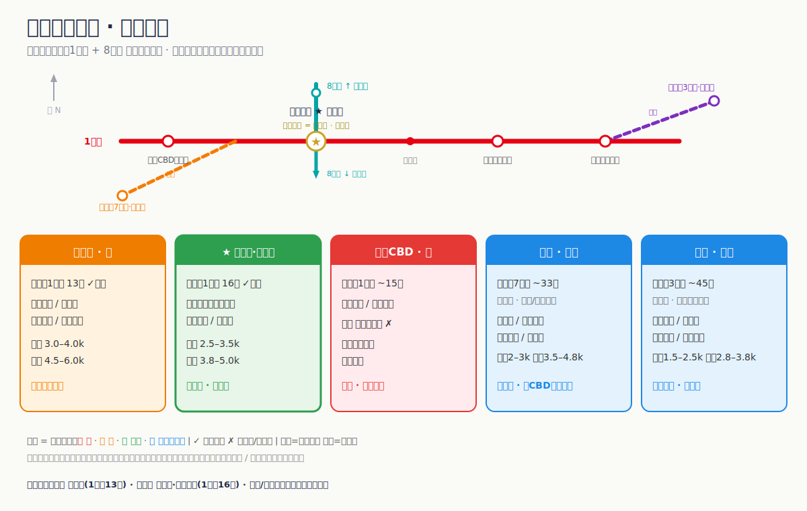

# amap-agent-skill

> 高德地图 Agent Skill（**无需 MCP**）—— 给 Claude Code / pi / 任意带 shell 的 AI agent 的高德地图能力：地理编码、逆地理、POI 搜索、天气、路径规划、距离测算、IP 定位。纯 `curl`，**设一个 key 就能用**。
>
> *AMap (Gaode) maps as an Agent Skill — geocoding, POI search, weather & route planning for Claude Code, pi, or any shell agent. Pure curl, no MCP server required.*

[](https://github.com/henrywen98/amap-agent-skill/actions/workflows/lint.yml)   



> 上图：用本 skill 做「找房前的地段决策」——把几个候选小区的通勤与价格画成一张对比图（[examples/](examples/)）。

---

## 这是什么

一个 [Agent Skill](https://agentskills.io/)：一个 `SKILL.md` + 一个 `scripts/amap.sh`（纯 `curl` 封装高德 [Web 服务 REST API](https://lbs.amap.com/api/webservice/summary)）。它把高德官方 MCP 里的 `maps_*` 工具，落成了**不需要 MCP server** 的命令行能力，因此能在**任何带 shell 的 agent**（pi、Claude Code、Codex…）里直接跑。

覆盖能力：

- 🧭 **地理编码 / 逆地理**：地址 ↔ 经纬度、坐标 → 行政区划
- 📍 **POI 搜索**：关键词搜、周边搜、POI 详情
- 🌦️ **天气**：实况 + 预报
- 🚗 **路径规划**：驾车 / 步行 / 骑行 / 公交地铁
- 📏 **距离测算** & 🌐 **IP 定位**

## 不是什么（边界）

它只读**公开的地理数据**。它**不碰**房源库存、实时报价、成交——那些锁在贝壳/链家/中介手里，是另一回事。所以「找房」这个示例里，本 skill 负责的是**找房前的决策**（哪片区、通勤多久、环境如何），具体房源和价格仍由你去平台/中介获取。

## 示例：找房前的地段决策（实战）

页首那张 `星合广场租房简图`，就是用本 skill 跑出来的一张决策图：以 **时代广场站（1 号线 + 8 号线换乘）** 为锚点，把苏州工业园区 5 个候选片区按「通勤 vs 租金」摊开对比。

| 片区（方位） | 通勤 | 月租（一室 / 两室） | 判定 |
|---|---|---|---|
| 时代广场（锚点） | 零通勤 | —— | 最贵 |
| 南施街（东） | 1 号线 **13 分直达** | 3–4k / 4.5–6k | 中 · 省心 |
| ⭐ 星塘街·海悦花园（东） | 1 号线 **16 分直达** | **2.5–3.5k / 3.8–5k** | **便宜 · 推荐** |
| 湖西 CBD（西） | 1 号线 ~15 分 | 同价或更贵 | 贵 · 不推荐（过桥更堵） |
| 娄葑（西南） | 7 号线 ~33 分换乘 | 2–3k / 3.5–4.8k | 便宜但绕 |
| 唯亭（东北） | 3 号线 ~45 分换乘 | 1.5–2.5k / 2.8–3.8k | 最便宜 · 最远 |

**结论**：最优是 ⭐ **星塘街·海悦花园**——和南施街几乎一样快（16 vs 13 分，都是 1 号线直达），但明显更便宜，是「通勤/租金」的甜点；往西的湖西 CBD 同价还更堵、纯亏；娄葑/唯亭只有预算特别紧才值得忍受换乘和长通勤。

它**只做决策那一半**：通勤、距离、周边环境用高德算出来，租金只给行情区间，**实际挂牌价交接给贝壳 / 安居客** 按小区名核对。复现命令见 [`examples/rental-decision.md`](examples/rental-decision.md)。

## 为什么不用 MCP

| | MCP 路 | 本 skill |
|---|---|---|
| 用户要做的事 | harness 支持 MCP → 配 `.mcp.json` → 拿 key | **放两个文件 → 拿 key** |
| 依赖 | 一个常驻 MCP server / 客户端 | 只要 `bash` + `curl`（系统自带） |
| 能跑在哪 | 支持 MCP 的工具 | **任何带 shell 的 agent** |

> 注册一个 key 这一步 MCP 也躲不掉（官方 MCP 地址也是 `mcp.amap.com/mcp?key=…`）。本 skill 没增加凭证负担，只是**拆掉了 MCP 那一层**。

## 快速开始

**1. 安装**（装进一个名为 `amap` 的 skill 目录）

```bash
# pi（原生发现 ~/.agents/skills）
git clone https://github.com/henrywen98/amap-agent-skill.git ~/.agents/skills/amap

# Claude Code（发现 ~/.claude/skills）
git clone https://github.com/henrywen98/amap-agent-skill.git ~/.claude/skills/amap
```

**2. 配 key**（[高德开放平台](https://lbs.amap.com/) → 创建应用 → 「Web 服务」key，需实名）

```bash
export AMAP_KEY=你的key            # 或写进当前项目的 .env：AMAP_KEY=你的key
```

**3. 用**

```bash
amap.sh weather 北京
amap.sh geo "上海市浦东新区世纪大道100号"
amap.sh around "121.5,31.23" 咖啡 800     # location 一律「经度,纬度」
amap.sh doctor                            # 校验 key + 缓存实时工具清单
```

或者直接对 agent 说「北京今天天气怎样」「我附近的咖啡馆」「从公司到机场怎么走」，它会读 `SKILL.md` 自己调。

## 命令清单

`location` 一律 `经度,纬度`（longitude 在前）。返回原始高德 JSON（`status:"1"` 为成功）。

| 命令 | 说明 |
|---|---|
| `geo <address> [city]` | 地址 → 经纬度 |
| `regeocode <lng,lat>` | 经纬度 → 行政区划地址 |
| `around <lng,lat> [kw] [radius]` | 周边搜 POI（默认 1000m） |
| `text <kw> [city] [citylimit]` | 关键词搜 POI |
| `detail <poiid>` | POI 详情 |
| `weather <city\|adcode> [base\|all]` | 天气（默认 all=预报） |
| `driving / walking / bicycling <o> <d>` | 驾车 / 步行 / 骑行路径 |
| `transit <o> <d> <city> [cityd]` | 公交地铁（跨城需 city/cityd） |
| `distance <origins> <dest> [type]` | 距离（type 0直线/1驾车/3步行） |
| `ip [ip]` | IP 定位 |
| `raw <path> [k v ...]` | 透传任意 v3/v4 接口 |
| `doctor [--refresh]` | 校验 key + 缓存实时工具清单 |

## 工作原理

- **热路径直连 REST**：每次 query 直接打 `restapi.amap.com`，**不经过 MCP**。命令 → REST 接口的映射，是**打包时**由高德 MCP 的 `tools/list` 自描述输出编译固化进脚本的。
- **`doctor` = 缓存式自描述**：想看高德当前暴露的工具/参数，`amap.sh doctor` 会一次性拉 `tools/list` 缓存到本地、`--refresh` 重拉。**仅用于发现**，不在 query 主路径（`tools/list` 不返回 REST 地址，日常无需它）。
- **key 解析**：`$AMAP_KEY`（回退 `$AMAP_MCP_KEY`）> 向上最近的 `.env`。

## 定位（「我在哪 / 附近的…」）

没坐标时，**别默认 IP 定位**（挂代理会定错）。macOS 推荐用 [whereami](https://github.com/lassik/whereami) 走系统定位拿精确坐标；非 mac 让用户给地名或坐标。注意 whereami/GPS 是 **WGS-84**、高德是 **GCJ-02**，国内有约几百米偏移（市区级可忽略，门牌/POI 级要留意）。详见 `SKILL.md`。

## 可视化

需要对比/出图时，skill 会**优先生成 SVG**（像上面那张）；若 harness 无法内联渲染 SVG，则在回复里**直接给 markdown 表 / ASCII 简化版**，并始终附文字结论——绝不只依赖 SVG 被渲染。

## 安全

- 仓库**不含**任何真实 key；只有 `.env.example`。`.env` 已在 `.gitignore`。
- 自己注册 key，并在高德控制台为它设置**域名/服务白名单 + 配额**，避免泄露被盗刷。

## 致谢 / 相关

- [高德开放平台 · Web 服务 API](https://lbs.amap.com/api/webservice/summary)
- [Agent Skills 标准](https://agentskills.io/) · [pi coding agent 的 "No MCP" 哲学](https://mariozechner.at/posts/2025-11-02-what-if-you-dont-need-mcp/)

## 贡献

欢迎 issue / PR。改脚本前请确保 `shellcheck scripts/amap.sh` 与 `bash -n scripts/amap.sh` 通过（CI 也会自动跑）。

## License

[MIT](LICENSE)

---

### English summary

**amap-agent-skill** is an MCP-free [Agent Skill](https://agentskills.io/) wrapping the **AMap / Gaode (高德地图)** Web Service REST API in a single `bash` + `curl` script. It gives **Claude Code**, **pi**, or any shell-capable LLM agent geocoding, reverse geocoding, POI search, weather, route planning (driving / walking / cycling / transit), distance and IP-location tools — **no MCP server, just set an `AMAP_KEY`**. Keywords: AMap, Gaode map, China maps, agent skill, Claude Code skill, MCP alternative, geocoding, POI search, weather API, route planning, LLM tools.
